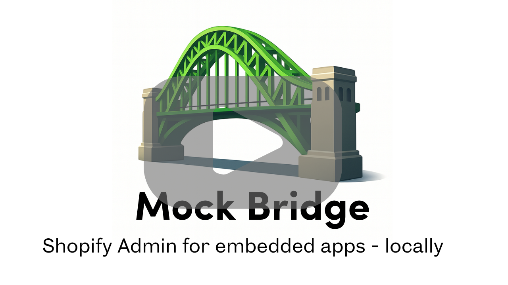

<div align="center">
  
  
  # Shopify Mock Bridge
  
  A comprehensive browser testing solution for Shopify embedded apps. Mock the Shopify Admin environment and App Bridge APIs locally without needing real Shopify credentials, captchas, or 2FA.
  
  [](https://www.npmjs.com/package/@getverdict/mock-bridge)
  [](https://opensource.org/licenses/MIT)
</div>

## 🎥 See It In Action

<div align="center">
  <a href="https://www.youtube.com/watch?v=swflaGObK4A" target="_blank">
    
  </a>
  
  **[▶️ Watch the Demo Video](https://www.youtube.com/watch?v=swflaGObK4A)** - See how Mock Bridge simplifies Shopify app testing
</div>

## 🎯 Why Use This Package?

**Testing Shopify embedded apps is hard:**

- 🚫 Shopify Admin requires 2FA and captchas
- 🤖 Playwright/automation tools can't bypass security
- 🔒 Chrome DevTools MCP can't interact with your embedded Shopify app
- 🌐 CI/CD pipelines need internet and credentials
- 🐛 Manual testing in real admin is slow and unreliable

**This package solves all of that:**

- ✅ No captchas, 2FA, or real Shopify account needed
- ✅ Full Playwright and automation support
- ✅ Chrome MCP and DevTools compatibility
- ✅ Works offline and in CI/CD pipelines
- ✅ Real database integration for comprehensive testing

## 🗺️ API Support

### Core Features
| Feature | Status | Notes |
|---------|--------|-------|
| iFrame embed | ✅ Supported | Full admin frame with Polaris styling |
| Session tokens | ✅ Supported | `shopify.idToken()` |
| Mock environment detection | ✅ Supported | Auto-loads mock App Bridge |

### App Bridge APIs
| API | Status | Notes |
|-----|--------|-------|
| `shopify.modal` | ✅ Supported | `show()`, `hide()`, `toggle()` |
| `shopify.saveBar` | ✅ Supported | `show()`, `hide()`, `toggle()` |
| `shopify.loading` | ✅ Supported | `loading(boolean)` |
| `shopify.toast` | ✅ Supported | `show(message, options)`, `hide(id)`; rendered in the admin |
| `shopify.idToken` | ✅ Supported | Returns valid JWT |
| `shopify.config` | ✅ Supported | `apiKey`, `shop`, `locale` |
| `shopify.environment` | ✅ Supported | `embedded`, `mobile`, `pos` |
| `shopify.user` | ✅ Supported | Returns mock user object |
| `shopify.scopes` | 🔶 Stub | Returns mock data |
| `shopify.resourcePicker` | 🔶 Stub | Returns empty array; configurable in [unit tests](#-unit-testing-with-vitest) |
| `shopify.picker` | 🔶 Stub | Returns empty selection |
| `shopify.scanner` | 🔶 Stub | Returns mock scan data |
| `shopify.pos` | 🔶 Stub | Cart API with mock data |
| `shopify.intents` | 🔶 Stub | `invoke()`, `register()` |
| `shopify.webVitals` | 🔶 Stub | Callback registration only |
| `shopify.support` | 🔶 Stub | Callback registration only |
| `shopify.reviews` | 🔶 Stub | Returns success |
| `shopify.app` | 🔶 Stub | Returns empty extensions |
| Authenticated fetch | ✅ Supported | `shopify:admin/...` direct API access and `/admin/api/...`; mock, proxy, or direct modes. Same-origin requests get `Authorization: Bearer <id token>` |
| Navigation | ❌ Not implemented | |
| Print | ❌ Not implemented | |
| Share | ❌ Not implemented | |

### Web Components
| Component | Status | Notes |
|-----------|--------|-------|
| `<ui-modal>` | ✅ Supported | With `<ui-title-bar>` support |
| `<ui-save-bar>` | ✅ Supported | With `data-save-bar` form integration |
| `<ui-nav-menu>` | ✅ Supported | Displays in admin sidebar |
| `<ui-title-bar>` | ✅ Supported | Inside modals |
| `<s-app-window>` | ❌ Not implemented | |

**Legend:** ✅ Supported | 🔶 Stub (returns mock data) | ❌ Not implemented

## 📦 Installation

```bash
npm install @getverdict/mock-bridge --save-dev
# or
yarn add @getverdict/mock-bridge --dev
# or
pnpm add @getverdict/mock-bridge --save-dev
```

## ⚡ Quick Start (2 Commands)

```bash
# 1. Install the package
npm install @getverdict/mock-bridge --save-dev

# 2. Start the mock (just provide your app URL)
npx @getverdict/mock-bridge http://localhost:3000
```

**That's it!** Your app is now running in a mock Shopify Admin at http://localhost:3080

## 🚀 Quick Start Guide

### Step 1: Start the Mock Server

#### Option A: One-Command Start (Recommended)

```bash
# Simplest - just provide your app URL
npx @getverdict/mock-bridge http://localhost:3000

# Auto-detects client ID from SHOPIFY_API_KEY environment variable
# Auto-detects common app paths and configurations
```

#### Option B: Configuration File

```bash
# Generate a config file
npx @getverdict/mock-bridge init

# Edit the generated mock.config.js, then run:
npx @getverdict/mock-bridge
```

```bash
# Add to package.json scripts for easy access
{
  "scripts": {
    "dev": "next dev",
    "mock:admin": "mock-bridge http://localhost:3000",
    "dev:mock": "concurrently \"npm run dev\" \"npm run mock:admin\""
  }
}
```

#### Option C: Programmatic API

If you need more control, you can still use the programmatic API:

```javascript
// scripts/start-mock-admin.js
const { MockShopifyAdminServer } = require("@verdict/mock-bridge");

async function startMockAdmin() {
  const server = new MockShopifyAdminServer({
    appUrl: "http://localhost:3000",
    clientId: process.env.SHOPIFY_API_KEY,
    clientSecret: "mock-secret-12345",
    port: 3080,
    debug: true,
  });

  await server.start();
  console.log("🎉 Mock Shopify Admin ready at http://localhost:3080");
}

startMockAdmin().catch(console.error);
```

### Step 2: Frontend Integration

Enable your app to detect and use the mock environment:

#### Option A: Automatic Detection (Recommended)

Replace your App Bridge script loading:

```html
<!-- Before: Direct CDN loading -->
<script src="https://cdn.shopify.com/shopifycloud/app-bridge.js"></script>

<!-- After: Smart loading with mock support -->
<script>
  // Check if we're in a mock environment
  const urlParams = new URLSearchParams(window.location.search);
  const isEmbedded = urlParams.get("embedded") === "1";
  const host = urlParams.get("host");

  let isMockEnvironment = false;

  // Detect mock environment from URL parameters
  if (isEmbedded && host) {
    try {
      const decodedHost = atob(host);
      if (
        decodedHost.includes("localhost") ||
        decodedHost.includes("mock") ||
        window.location.hostname === "localhost"
      ) {
        isMockEnvironment = true;
      }
    } catch (e) {
      // Ignore decode errors
    }
  }

  // Load appropriate App Bridge
  if (isMockEnvironment) {
    console.log("Loading Mock App Bridge");
    const script = document.createElement("script");
    script.src = "http://localhost:3080/app-bridge.js";
    script.onerror = () => {
      // Fallback to real CDN if mock fails
      const fallback = document.createElement("script");
      fallback.src = "https://cdn.shopify.com/shopifycloud/app-bridge.js";
      document.head.appendChild(fallback);
    };
    document.head.appendChild(script);
  } else {
    console.log("Loading Real Shopify App Bridge");
    const script = document.createElement("script");
    script.src = "https://cdn.shopify.com/shopifycloud/app-bridge.js";
    document.head.appendChild(script);
  }
</script>
```

#### Option B: Package Utility (TypeScript)

```typescript
// app.tsx or _app.tsx
import { setupAppBridge } from "@getverdict/mock-bridge/client";

useEffect(() => {
  setupAppBridge({
    debug: true,
    onMockDetected: (mockServerUrl) => {
      console.log("Mock environment detected:", mockServerUrl);
    },
    onShopifyDetected: () => {
      console.log("Real Shopify environment detected");
    },
  })
    .then(() => {
      console.log("App Bridge loaded successfully");
    })
    .catch(console.error);
}, []);
```

### Step 3: Backend Integration

Make your backend support mock session tokens alongside real ones:

#### Quick Integration (Replace existing JWT validation)

```typescript
// Before: Only real Shopify tokens
import { verifyShopifyJWT } from "./your-auth";

export async function authenticate(token: string) {
  const authData = await verifyShopifyJWT(token);
  // ... rest of auth logic
}
```

```typescript
// After: Support both real and mock tokens
import {
  validateSessionToken,
  createMockUser,
} from "@getverdict/mock-bridge/auth";

export async function authenticate(token: string) {
  const authData = await validateSessionToken(token, {
    shopifySecret: process.env.SHOPIFY_API_PRIVATE_KEY!,
  });

  if (!authData) {
    throw new Error("Invalid token");
  }

  // Get shop from your database (same for both mock and real)
  const shop = await getShopByName(authData.shopName);
  if (!shop) {
    throw new Error("Shop not found");
  }

  if (authData.isMock) {
    // Mock environment - skip Shopify API calls
    return {
      shop,
      currentUser: createMockUser({
        shopName: authData.shopName,
        permissions: shop.settings?.defaultStaffPermissions,
      }),
      isMock: true,
    };
  } else {
    // Real environment - proceed with normal Shopify flow
    const currentUser = await exchangeTokenForUser(token, shop);
    return {
      shop,
      currentUser,
      isMock: false,
    };
  }
}
```

#### Framework-Specific Examples

**Next.js API Routes:**

```typescript
// pages/api/products.ts
import { validateSessionToken } from "@getverdict/mock-bridge/auth";

export default async function handler(req, res) {
  const token = req.headers.authorization?.replace("Bearer ", "");

  const authData = await validateSessionToken(token, {
    shopifySecret: process.env.SHOPIFY_API_PRIVATE_KEY!,
  });

  if (!authData) {
    return res.status(401).json({ error: "Unauthorized" });
  }

  if (authData.isMock) {
    // Return mock data for testing
    return res.json({
      products: [
        { id: "1", title: "Mock Product 1", price: "19.99" },
        { id: "2", title: "Mock Product 2", price: "29.99" },
      ],
    });
  } else {
    // Fetch real products from Shopify
    const products = await fetchShopifyProducts(authData.shopName);
    return res.json({ products });
  }
}
```

**Express.js Middleware:**

```typescript
import {
  validateSessionToken,
  createMockUser,
} from "@getverdict/mock-bridge/auth";

function createAuthMiddleware() {
  return async (req, res, next) => {
    const token = req.headers.authorization?.replace("Bearer ", "");

    const authData = await validateSessionToken(token, {
      shopifySecret: process.env.SHOPIFY_API_PRIVATE_KEY!,
    });

    if (!authData) {
      return res.status(401).json({ error: "Unauthorized" });
    }

    const shop = await getShopByName(authData.shopName);
    req.shop = shop;
    req.isMockAuth = authData.isMock;

    if (authData.isMock) {
      req.currentUser = createMockUser({ shopName: authData.shopName });
    } else {
      req.currentUser = await exchangeTokenForUser(token, shop);
    }

    next();
  };
}

app.use("/api/*", createAuthMiddleware());
```

### Step 4: Database Setup

Ensure your mock shop exists in the database:

```typescript
// Add this to your database seed or setup script
async function setupMockShop() {
  const mockShop = {
    name: "test-shop.myshopify.com",
    displayName: "Mock Test Shop",
    accessToken: "mock-access-token",
    active: true,
    settings: {
      defaultStaffPermissions: [
        "read_products",
        "write_products",
        "read_orders",
        "write_orders",
      ],
    },
  };

  await createOrUpdateShop(mockShop);
  console.log("Mock shop created for testing");
}

// Run during development setup
if (process.env.NODE_ENV === "development") {
  setupMockShop();
}
```

### Step 5: Start Development

```bash
# Option 1: CLI command (simplest)
npx @getverdict/mock-bridge http://localhost:3000

# Option 2: Package.json scripts
npm run dev:mock

# Option 3: Separate terminals
npm run dev                    # Terminal 1: Your app
npm run mock:admin            # Terminal 2: Mock admin
```

**Then navigate to:**

- **Your app**: http://localhost:3000
- **Mock Shopify Admin**: http://localhost:3080
- **Your app embedded in mock admin**: http://localhost:3080 (automatically embeds your app)

## 🖥️ CLI Reference

### Quick Commands

```bash
# Basic usage with auto-detection
npx @getverdict/mock-bridge http://localhost:3000

# If installed locally, you can use the shorter command:
# npm install @getverdict/mock-bridge --save-dev
# npx mock-bridge http://localhost:3000

# Full configuration
npx @getverdict/mock-bridge http://localhost:3000/shopify \
  --client-id your-client-id \
  --port 3080 \
  --debug

# Using config file
npx @getverdict/mock-bridge init           # Create config file
npx @getverdict/mock-bridge                # Use config file

# Help and version
npx @getverdict/mock-bridge --help
npx @getverdict/mock-bridge --version
```

### CLI Options

| Option            | Description                          | Default                         |
| ----------------- | ------------------------------------ | ------------------------------- |
| `[app-url]`       | Your app's URL (positional argument) | Auto-detected from package.json |
| `--client-id`     | Shopify app client ID                | `$SHOPIFY_API_KEY`              |
| `--client-secret` | Mock client secret                   | `"mock-secret-12345"`           |
| `--shop`          | Mock shop domain                     | `"test-shop.myshopify.com"`     |
| `--port`          | Mock admin port                      | `3080`                          |
| `--config`        | Config file path                     | `"mock.config.js"`              |
| `--debug`         | Enable debug logging                 | `false`                         |

### Environment Variables

The CLI automatically reads these environment variables:

```bash
SHOPIFY_API_KEY=your-client-id      # Used for --client-id
NODE_ENV=development                # Enables mock token support
```

### Configuration File

Generate a configuration file with `npx @getverdict/mock-bridge init`:

```javascript
// mock.config.js
module.exports = {
  appUrl: "http://localhost:3000/shopify", // Include path in URL
  clientId: process.env.SHOPIFY_API_KEY,
  clientSecret: "mock-secret-12345",
  port: 3080,
  shop: "test-shop.myshopify.com",
  debug: true,
  scopes: ["read_products", "write_products", "read_orders", "write_orders"],
};
```

## 🎭 How It Works

### Architecture Overview

```
┌─────────────────────────────────────┐
│   Mock Shopify Admin (Port 3080)   │
│  ┌─────────────────────────────┐   │
│  │     Shopify Admin UI         │   │
│  │     (Navigation, etc.)       │   │
│  └─────────────────────────────┘   │
│  ┌─────────────────────────────┐   │
│  │   Your App (iframe)          │   │  ← Embedded like real Shopify
│  │   - Mock App Bridge loaded   │   │
│  │   - Gets mock session tokens │   │
│  │   - Makes API calls to your  │   │
│  │     backend                  │   │
│  └─────────────────────────────┘   │
└─────────────────────────────────────┘
         ↕ PostMessage API
┌─────────────────────────────────────┐
│    Your Backend                     │
│    - Validates mock tokens          │  ← Same backend, enhanced auth
│    - Skips Shopify API calls        │
│    - Uses real database             │
│    - Returns mock/real data         │
└─────────────────────────────────────┘
```

### Mock vs Real Flow

**Mock Environment (Testing):**

1. Mock admin serves your app in iframe
2. Mock App Bridge provides session tokens
3. Your frontend makes API calls to your backend
4. Backend detects mock tokens and skips Shopify APIs
5. Returns mock data or uses database directly

**Real Environment (Production):**

1. Real Shopify admin serves your app in iframe
2. Real App Bridge provides session tokens
3. Your frontend makes API calls to your backend
4. Backend detects real tokens and calls Shopify APIs
5. Returns real data from Shopify

## 🔧 Configuration Options

### Mock Server Configuration

```typescript
const server = new MockShopifyAdminServer({
  // Required
  appUrl: "http://localhost:3000/shopify", // Your app's URL (with path)
  clientId: "your-shopify-client-id", // Your Shopify app's client ID
  clientSecret: "mock-secret-12345", // Mock secret (dev only)

  // Optional
  port: 3080, // Mock admin port
  shop: "test-shop.myshopify.com", // Mock shop domain
  apiVersion: "2024-01", // Shopify API version
  scopes: [
    // Your app's scopes
    "read_products",
    "write_products",
    "read_orders",
    "write_orders",
  ],
  debug: true, // Enable debug logging

  // Admin API handling (see below)
  adminApi: "mock",
});
```

### Admin API Configuration

Control how `fetch('/admin/api/...')` requests are handled:

```javascript
// mock.config.js

// Option 1: Mock data (default) - returns fake data, works offline
module.exports = {
  adminApi: "mock",
};

// Option 2: Proxy through your app - for real data via your backend
module.exports = {
  adminApi: {
    proxy: "http://localhost:3000/api/shopify-proxy",
  },
};

// Option 3: Direct to Shopify - requires access token from installed shop
module.exports = {
  adminApi: {
    accessToken: process.env.SHOPIFY_ACCESS_TOKEN,
  },
};
```

**When to use each mode:**

| Mode | Use Case |
|------|----------|
| `'mock'` | Offline testing, CI/CD, no Shopify credentials needed |
| `{ proxy: '...' }` | Real data testing via your app's backend proxy |
| `{ accessToken: '...' }` | Direct Shopify API access (requires installed shop) |

**Proxy endpoint example** (if using proxy mode):

```typescript
// pages/api/shopify-proxy.ts (Next.js example)
export default async function handler(req, res) {
  const { url, method, body } = req.body;
  const shop = await getShopFromSession(req);

  const response = await fetch(`https://${shop.domain}${url}`, {
    method,
    headers: {
      "X-Shopify-Access-Token": shop.accessToken,
      "Content-Type": "application/json",
    },
    body: body ? JSON.stringify(body) : undefined,
  });

  res.json(await response.json());
}
```

### Authentication Options

```typescript
const authData = await validateSessionToken(token, {
  shopifySecret: process.env.SHOPIFY_API_PRIVATE_KEY!, // Required
  mockSecret: "custom-mock-secret", // Optional
  developmentOnly: true, // Only try mock in dev
});
```

### Mock User Options

```typescript
const mockUser = createMockUser({
  shopName: "test-shop.myshopify.com",
  userId: "123456789", // Custom user ID
  email: "test@shop.com", // Custom email
  firstName: "Test", // Custom first name
  lastName: "User", // Custom last name
  permissions: ["read_products"], // Custom permissions
  additionalProps: {
    // Any additional props
    posBillingTermsAcceptedAt: new Date(),
    customField: "value",
  },
});
```

## 🎪 Testing with Automation Tools

### Playwright Example

```typescript
// playwright.config.ts
import { defineConfig } from "@playwright/test";
import { MockShopifyAdminServer } from "@getverdict/mock-bridge";

let mockServer: MockShopifyAdminServer;

export default defineConfig({
  globalSetup: async () => {
    mockServer = new MockShopifyAdminServer({
      appUrl: "http://localhost:3000",
      clientId: "test-client-id",
      clientSecret: "mock-secret-12345",
      port: 3080,
    });
    await mockServer.start();
  },

  globalTeardown: async () => {
    await mockServer?.stop();
  },

  use: {
    baseURL: "http://localhost:3080",
  },
});
```

```typescript
// tests/app.spec.ts
import { test, expect } from "@playwright/test";

test("should load app in mock Shopify admin", async ({ page }) => {
  await page.goto("/");

  // Wait for app to load in iframe
  const appFrame = page.frameLocator("#app-iframe");

  // Test your app functionality
  await expect(appFrame.locator("h1")).toContainText("Your App Title");

  // Test App Bridge actions
  await appFrame.locator('button:has-text("Show Toast")').click();
  await expect(page.locator(".toast")).toContainText("Success!");

  // Test API calls
  await appFrame.locator('button:has-text("Load Products")').click();
  await expect(appFrame.locator(".product-list")).toBeVisible();
});

test("should handle authentication", async ({ page }) => {
  await page.goto("/");

  const appFrame = page.frameLocator("#app-iframe");

  // Your app should be authenticated automatically
  await expect(appFrame.locator(".user-info")).toContainText("Mock User");
  await expect(appFrame.locator(".shop-info")).toContainText(
    "test-shop.myshopify.com"
  );
});
```

### Jest Integration Testing

```typescript
// tests/api.test.ts
import { MockShopifyAdminServer } from "@getverdict/mock-bridge";
import {
  createMockUser,
  validateSessionToken,
} from "@verdict/shopify-app-bridge-mock/auth";

describe("API with Mock Tokens", () => {
  let mockServer: MockShopifyAdminServer;

  beforeAll(async () => {
    mockServer = new MockShopifyAdminServer({
      appUrl: "http://localhost:3000",
      clientId: "test-client",
      clientSecret: "mock-secret-12345",
    });
    await mockServer.start();
  });

  afterAll(async () => {
    await mockServer.stop();
  });

  it("should authenticate with mock token", async () => {
    // Generate mock token
    const token = mockServer.tokenGenerator.generateSessionToken({
      shop: "test-shop.myshopify.com",
      clientId: "test-client",
      clientSecret: "mock-secret-12345",
    });

    // Test authentication
    const authData = await validateSessionToken(token, {
      shopifySecret: "real-secret",
      mockSecret: "mock-secret-12345",
    });

    expect(authData?.isMock).toBe(true);
    expect(authData?.shopName).toBe("test-shop.myshopify.com");
  });

  it("should create mock users", async () => {
    const mockUser = createMockUser({
      shopName: "test-shop.myshopify.com",
      permissions: ["read_products"],
    });

    expect(mockUser.email).toBe("mock@test-shop.com");
    expect(mockUser.permissions).toContain("read_products");
  });
});
```

## 🧪 Unit Testing with Vitest

For component tests there's no need for the mock server or an iframe. `@getverdict/mock-bridge/vite` installs `window.shopify` in each Vitest test file, backed by an in-process host:

- **Admin API:** `fetch('shopify:admin/...')` and `/admin/api/...` requests are answered by handlers you register. Nothing goes over the network.
- **Admin UI:** toasts, save bars, loading, modals and the nav menu are recorded so tests can assert on them.
- **Id tokens:** `shopify.idToken()` returns real HS256 tokens signed with WebCrypto.

### Browser Mode (recommended)

`browser: true` runs tests in a real Chromium with [Vitest Browser Mode](https://vitest.dev/guide/browser/). The test page loads Polaris from Shopify's CDN, as the admin does, so `s-page`, `s-button` and the other `s-*` components render and behave for real.

```bash
npm install -D @getverdict/mock-bridge vitest @vitest/browser-playwright playwright
npx playwright install chromium
```

```ts
// vitest.config.ts
import { mockBridge } from "@getverdict/mock-bridge/vite";
import { defineConfig } from "vitest/config";

export default defineConfig({
  plugins: [mockBridge({ shop: "my-shop.myshopify.com", browser: true })],
});
```

`browser` also accepts `{ headless, instances, polaris }`. `instances` defaults to `[{ browser: "chromium" }]`. `polaris: false` skips loading Polaris, for offline runs. Any `test.browser` settings in your config take precedence.

### jsdom

Without `browser`, tests run in jsdom. It's faster to start and needs no browser, but `s-*` elements are inert: event handlers still fire, but nothing renders. The plugin sets `environment: 'jsdom'` unless you've set an environment yourself.

```bash
npm install -D @getverdict/mock-bridge vitest jsdom
```

```ts
export default defineConfig({
  plugins: [mockBridge({ shop: "my-shop.myshopify.com" })],
});
```

### Writing tests

The same tests run in either mode.

```tsx
// app.test.tsx
import { bridge } from "@getverdict/mock-bridge/vitest";
import { render, screen, waitFor } from "@testing-library/preact";
import App from "./app";

test("lists fees", async () => {
  bridge.graphql("FeeRules", ({ variables }) => ({ data: { metaobjects: { nodes: [/* ... */] } } }));

  render(<App />);

  expect(await screen.findByText("Mississippi")).toBeTruthy();
});

test("toasts errors", async () => {
  bridge.graphql("FeeRules", () => ({ errors: [{ message: "Access denied" }] }));
  render(<App />);
  await waitFor(() => expect(bridge.toasts()).toContainEqual(expect.objectContaining({ message: "Access denied", isError: true })));
});
```

Each test file gets a fresh bridge. Handlers registered at the top level or in `beforeAll` last for the whole file; handlers and recorded state from a test are reset after it (the same model as msw).

### `bridge` API

| Member | Description |
|--------|-------------|
| `graphql(operationName, handler)` | Answers a GraphQL operation by name (`'*'` answers any unhandled one). `handler(request)` receives `{ url, method, headers, body, operationName, query, variables }` and returns a JSON body or a `Response`. Unhandled operations reject with a hint. |
| `rest(method, path, handler)` | Answers REST Admin requests; `path` is matched after `/admin/api/<version>/`, e.g. `'products.json'` or a RegExp. |
| `resourcePicker(selection)` | What `shopify.resourcePicker()` resolves to; `undefined` simulates cancelling. Default `[]`. |
| `toasts()` | Toasts shown so far: `{ id, message, isError, duration, action }`. |
| `saveBar(id)` / `modal(id)` / `navMenu()` / `loading()` | Admin-side state. |
| `adminRequests` / `calls` | Every Admin API request and every App Bridge action, in order. |
| `idToken()` | A fresh session token. |
| `stores` | The underlying zustand stores the admin-frame renders from. |

Plugin options: `shop`, `apiKey`, `clientSecret` (pass your app's secret to have your backend accept the tokens), `userId`, `locale`, `embedded`, `browser` (see above), and `environment` (see below).

### Pages that load App Bridge from the CDN

`mockBridge({ environment: 'mock-bridge' })` uses a jsdom environment for tests that load a page's HTML (`environmentOptions.jsdom.html`). It installs `window.shopify` before the page parses and serves stubs for `https://cdn.shopify.com/shopifycloud/app-bridge.js` and `polaris.js`, so classic page scripts see the mock just as they would the real App Bridge. Tests start after the page's `load` event. Pass `scripts: { [url]: body | null }` to stub other scripts, or `null` to load the real one. jsdom doesn't run `type="module"` scripts.

### Without Vitest

`createTestBridge(options)` from `@getverdict/mock-bridge/testing` is the same host with no test-runner coupling: `const bridge = createTestBridge(); const uninstall = bridge.install(window);`.

## ⚡ Vite dev server

The same plugin can run your app inside the mock admin during `vite dev`, without starting a separate `mock-bridge` process:

```ts
// vite.config.ts
import { mockBridge } from "@getverdict/mock-bridge/vite";

export default defineConfig({
  plugins: [mockBridge({ shop: "my-shop.myshopify.com", dev: true })],
});
```

`vite dev` then also starts the mock admin at http://localhost:3080, listed under Vite's own URLs, with your app embedded from Vite's URL. It serves `index.html` with the mock App Bridge in place of `https://cdn.shopify.com/shopifycloud/app-bridge.js`, so no detection snippet is needed. The mock admin stops when Vite does.

Leave `dev` unset to decide per run: `MOCK_BRIDGE=1 vite dev` enables it and a plain `vite dev` doesn't, which leaves `shopify app dev` against the real admin unaffected.

`dev` options: `port` (default 3080), `appPath` (the path the admin loads, e.g. `'/app'`), `appUrl` (when the app isn't served at Vite's local URL), `adminApi` (`'mock'`, `{ proxy }` or `{ accessToken }`, as for the server), `url` (use a mock-bridge server that's already running instead of starting one), and `debug`. `shop`, `apiKey`, `clientSecret` and `userId` are shared with the test options. Pass your app's `apiKey` and `clientSecret` to have your backend accept the mock id tokens.

**It never reaches production:** the plugin only applies to the dev server (`apply: 'serve'`), so `vite build` output is untouched, and it refuses to start the mock admin when Vite runs in production mode.

## 🛡️ Security Considerations

### Development Only

Mock tokens are designed for development and testing only:

```typescript
// ✅ Good: Mock tokens only in development
const authData = await validateSessionToken(token, {
  shopifySecret: process.env.SHOPIFY_API_PRIVATE_KEY!,
  developmentOnly: true, // Default: true
});

// ❌ Bad: Never allow mock tokens in production
const authData = await validateSessionToken(token, {
  shopifySecret: process.env.SHOPIFY_API_PRIVATE_KEY!,
  developmentOnly: false, // Don't do this!
});
```

### Environment Variables

Keep mock secrets out of production:

```bash
# .env.local (development only)
SHOPIFY_API_PRIVATE_KEY=your-real-shopify-secret
MOCK_SECRET=mock-secret-12345

# .env.production (no mock secrets)
SHOPIFY_API_PRIVATE_KEY=your-real-shopify-secret
# No MOCK_SECRET in production!
```

### Database Requirements

Mock tokens still require valid shops in your database:

```typescript
// Always verify shop exists, even for mock tokens
const authData = await validateSessionToken(token, options);
if (authData) {
  const shop = await getShopByName(authData.shopName);
  if (!shop) {
    // Reject both mock and real tokens if shop doesn't exist
    throw new Error("Shop not found");
  }
}
```

## 🐛 Troubleshooting

### Common Issues

**App not loading in mock admin:**

- Check CSP headers allow iframe embedding
- Verify your app URL is correct in mock config
- Ensure your app accepts `embedded=1` parameter

**Mock tokens not working:**

- Verify `NODE_ENV=development`
- Check mock secret matches between frontend and backend
- Ensure shop exists in your database

**Real tokens broken:**

- Verify `SHOPIFY_API_PRIVATE_KEY` is set correctly
- Check that real secret is passed to `validateSessionToken`
- Ensure your existing Shopify auth flow is preserved

### Debug Mode

Enable debug logging to troubleshoot:

```typescript
// Mock server with debug
const server = new MockShopifyAdminServer({
  // ... config
  debug: true,
});

// Frontend with debug
setupAppBridge({
  debug: true,
  onMockDetected: (url) => console.log("Mock detected:", url),
  onShopifyDetected: () => console.log("Real Shopify detected"),
});
```

### Environment Check

Verify your environment setup:

```typescript
// Add to your app startup
console.log("Environment:", process.env.NODE_ENV);
console.log("Has Shopify Secret:", !!process.env.SHOPIFY_API_PRIVATE_KEY);
console.log("Mock tokens enabled:", process.env.NODE_ENV === "development");
```

## 📚 API Reference

### Authentication Functions

#### `validateSessionToken(token, options)`

Universal validator for both real and mock tokens.

**Parameters:**

- `token: string` - JWT session token
- `options.shopifySecret: string` - Real Shopify client secret
- `options.mockSecret?: string` - Mock secret (default: "mock-secret-12345")
- `options.developmentOnly?: boolean` - Only try mock tokens in development (default: true)

**Returns:** `AuthResult | false`

#### `isMockToken(token, mockSecret?)`

Quick check if token is a mock token.

**Returns:** `boolean`

#### `createMockUser(options?)`

Generate mock user objects for testing.

**Returns:** `MockCurrentUser`

#### `withMockTokenSupport(authFunction, shopifySecret, options?)`

Wrapper to add mock support to existing auth functions.

#### `signSessionToken(options)` / `verifySessionToken(token, secret)`

Async, WebCrypto-based counterparts of `TokenGenerator` that run in Node, browsers and jsdom. Tokens are interchangeable with `TokenGenerator`'s and `jsonwebtoken`'s. `signJwt`, `verifyJwt` and `decodeJwt` are the lower-level helpers.

### Server Classes

#### `MockShopifyAdminServer`

Main mock server class.

**Methods:**

- `start()` - Start the mock server
- `stop()` - Stop the mock server
- `getConfig()` - Get server configuration

### Client Utilities

#### `setupAppBridge(options?)`

Automatically detect mock environment and load appropriate App Bridge.

**Returns:** `Promise<void>`

For complete API documentation, see [Backend Integration Guide](./docs/BACKEND_INTEGRATION.md).

## 🤝 Contributing

Contributions are welcome! Please feel free to submit issues, feature requests, or pull requests.

### Development Setup

```bash
git clone <repository>
cd packages/shopify-app-bridge-mock
pnpm install
pnpm build
pnpm test
```

## 📄 License

MIT License - see LICENSE file for details.

## 🙏 Acknowledgments

- Built for the Shopify developer community
- Inspired by the need for better testing tools
- Thanks to all contributors and users

---

**Made with ❤️ for Shopify developers who want to test without pain**
